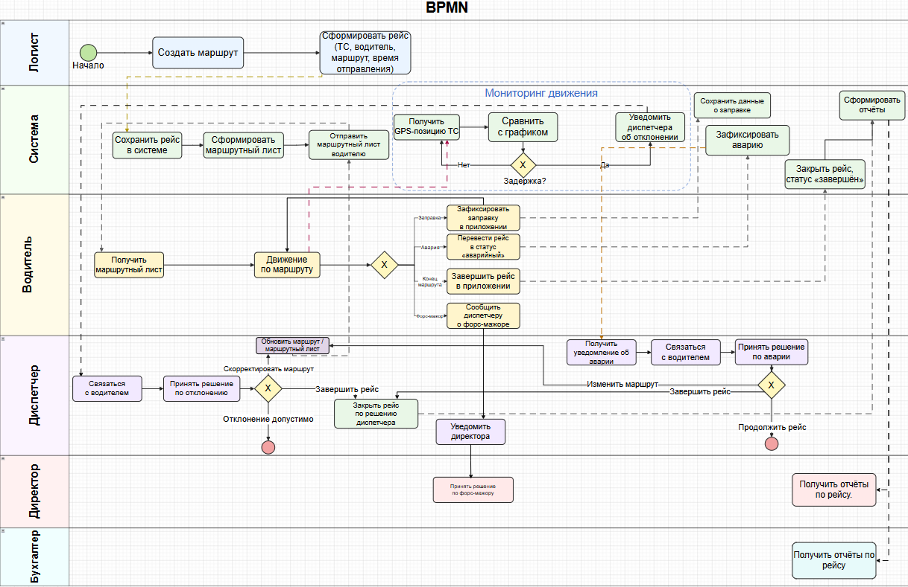

# Документы жизненного цикла ПО. Функциональное проектирование. Бизнес- и системная аналитика.  

**Вариант 12:** Система мониторинга междугородных транспортных перевозок.
Населенные пункты, дорожная сеть, маршрут, планирование движения по маршруту, GPS-
навигация транспортных средств, отслеживание графика движения по маршруту,
обработка аварийных ситуаций, отслеживание заправки, отчеты по расходу топлива и
рабочему времени водителей.

## Фаза исследования. Бизнес-анализ

### Бизнес-архитектура

---
#### Перечень заинтересованных лиц и пользователей проекта

Пользователи системы, непосредственно (caseWorker) и опосредованно (Worker) взаимодействующие с системой:

**Непосредственные пользователи:**
- **диспетчер**,
- **логист**,
- **водитель**,
- **руководитель (Директор)**,
- **системный администратор**.

**Опосредованные участники:**
- **бухгалтер**,

---
#### Границы проекта

Границы проекта определяют точки взаимодействия со сторонними системами и акторами, а также содержание поддерживаемой функциональности:

1. **Учет расхода топлива. Бухгалтерия.** Система формирует отчёты по расходу топлива, на основании которых бухгалтер ведёт финансовый учёт.
2. **Расчёт заработной платы. Бухгалтерия.** Система фиксирует рабочее время водителей и формирует соответствующие отчёты, но не производит расчёт заработной платы.
3. **Аналитика.** Система архивирует данные о выполненных операциях, а также 
формирует отчеты, но не производит аналитические расчеты. 
4. **Приём заказов на перевозку.** Система не управляет взаимодействием с клиентами и не оформляет заказы на перевозку грузов.
5. **Техническое обслуживание ТС.** Система фиксирует аварийные события, но не управляет процессом технического обслуживания.
6. **Взаимодействие с экстренными службами.** При аварийной ситуации диспетчер связывается с экстренными службами вне системы.
7. **Автоматическое перепланирование маршрута.** Система уведомляет об отклонениях от графика, но не перестраивает маршрут автоматически.

---
#### Глоссарий

**Система** —  программная система (ПС), совокупность аппаратных и программных 
компонент.

**Транспортное средство (ТС)** — грузовой автомобиль организации, оснащённый GPS-трекером.

**GPS-трекер** — устройство, установленное на ТС, периодически передающее координаты, скорость и время в систему.

**Населенный пункт** — географический объект (город, посёлок и т.д.) с фиксированными GPS-координатами, являющийся узловой точкой дорожной сети.

**Дорожная сеть** — совокупность дорог между населёнными пунктами.

**Маршрут** — запланированная последовательность из населённых пунктов и дорог между ними.

**Рейс** — конкретное выполнение маршрута: ТС, водитель, дата и время отправления. Имеет один из статусов: планируется, в пути, завершён, авария.

**График движения** — плановое время прибытия ТС в каждую узловую точку маршрута.

**Отклонение от графика** — разность между фактическим и плановым временем прохождения точки маршрута. Отклонение сверх установленного порога формирует уведомление диспетчеру.

**GPS-позиция** — передаваемые данные от GPS-трекера: координаты, скорость, время фиксации.

**Аварийная ситуация** — предусмотренное системой внештатное событие в течение рейса: ДТП, поломка ТС, критическое отклонение от графика. Фиксируется диспетчером; обрабатывается в рамках стандартных процедур. Имеет тип, описание, время возникновения и статус (открыта, обрабатывается, закрыта).

**Заправка** — событие пополнения топлива ТС в ходе рейса. Фиксируется: GPS-позиция, объём в литрах, стоимость.

**Сотрудник** — базовая сущность для диспетчера, логиста, водителя, директора, системного администратора и бухгалтера.

**Диспетчер** — сотрудник. Наблюдает за транспортными средствами на карте, отслеживает отклонения от графика, обрабатывает аварийные ситуации, координирует водителей.

**Логист** — сотрудник. Планирует маршруты и графики, назначает транспортные средства и водителей на рейсы.

**Водитель**- сотрудник. Просматривает маршрут и график, фиксирует заправки, сообщает об аварийных ситуациях.

**Системный администратор** - сотрудник. Занимается настройкой и администрированием системы, управлением учётными записями.

**Бухгалтер** - сотрудник. Получает отчёты по расходу топлива, рабочему времени водителей для учёта.

**Директор** - сотрудник. Получает отчёты по расходу топлива, рабочему времени водителей. Уведомляется диспетчером и принимает решения при форс-мажорах.

**Форс-мажор** — неопределённое состояние рейса, при котором данные системы не отражают реальность. Диспетчер переводит рейс в статус «форс-мажор» и уведомляет директора для принятия управленческого решения.

---
## Видение проекта

**Название проекта:** Система мониторинга междугородных транспортных перевозок

**Цели проекта:**
- Обеспечить контроль местоположения ТС в режиме реального времени.
- Автоматизировать контроль соблюдения графиков движения с уведомлением диспетчера.
- Сократить время реакции на аварийные ситуации за счёт оперативного уведомления диспетчера.
- Вести учёт заправок и рассчитывать фактический расход топлива.
- Предоставить аналитические отчёты для управления затратами и ресурсами.

**Приоритет проекта:** средний — оптимизирует работы, дает возможность их мониторинга в режиме реального времени.

**Результаты проекта:**
- Web/desktop-приложение диспетчера и логиста с картой и списками рейсов.
- Desktop-приложение с модулем отчётов.
- Мобильное приложение водителя (Android) — просмотр маршрута, фиксация заправок и аварий.
- Серверный модуль.

**Допущения и ограничения:**
- Все ТС оснащены GPS-трекерами.
- Все населенные пункты существуют и корректно отображены на картах.

**Ключевые участники:**
- диспетчер,
- логист,
- водитель,
- директор,
- системный администратор.

**Заинтересованные стороны:**
- бухгалтер.

**Ресурсы проекта:**
- Команда разработки (backend, frontend, мобильная разработка).
- GPS-трекеры на ТС.
- Сервер для приёма данных и хранения истории.

**Риски:**
- Потеря GPS-сигнала в зонах слабого покрытия мобильной сети.
- Ложные уведомления при кратковременных сбоях связи.
- Неточность GPS в городской застройке.

**Критерии приёмки:**
- Задержка отображения позиции ТС ≤ 60 секунд;
- Уведомление об отклонении от графика ≤ 10 минут после события;
- Корректная генерация отчётов за произвольный период.

**Обоснование полезности проекта:**
Система снижает операционные затраты за счет контроля расхода топлива, повышает безопасность перевозок через оперативное реагирование на аварии, обеспечивает объективный учет рабочего времени водителей.

---
## Моделирование бизнес-процессов

### Неформальное описание бизнес-процессов. Выделение бизнес-сущностей.

Организация осуществляет междугородные транспортные перевозки на **транспортных средствах (ТС)**, оснащённых **GPS-трекерами**.

Логист формирует **маршруты** — последовательности **населённых пунктов**, соединённых **дорогами**. Для каждого маршрута логист составляет **график движения**.
Для выполнения конкретной перевозки логист формирует **рейс**: назначает **маршрут**, **ТС**, водителя, устанавливает дату и время отправления.
Водитель через мобильное приложение получает маршрутный лист с **графиком**.

В ходе **рейса** GPS-трекер ТС периодически передаёт **GPS-позиции** на сервер системы.

Диспетчер в режиме реального времени наблюдает за движением всех **ТС** на карте. Система автоматически сравнивает фактическое прохождение **точек маршрута** с плановым **графиком движения**. При **отклонении от графика** сверх допустимого порога диспетчер получает уведомление, связывается с водителем и принимает решение.

При возникновении **аварийной ситуации** водитель сообщает об этом диспетчеру через приложение. Диспетчер фиксирует событие в системе, переводит **рейс** в статус «аварийный». Организация помощи происходит вне системы.

При возникновении **форс-мажора** (длительной потере GPS-сигнала или устойчивом расхождении данных системы с реальностью) диспетчер фиксирует состояние и уведомляет директора. Директор принимает решение вне системы.

Водитель самостоятельно регистрирует **заправку**: указывает место, объём топлива и стоимость. Система автоматически сравнивает данные с **нормативом расхода**.

По завершении **рейса** директор и бухгалтер получают **отчёты** по расходу топлива и по рабочему времени водителей. Данные **отчётов** используются для расчёта оплаты труда и контроля затрат вне системы.

### Формальное описание бизнес-процессов.

BPMN-диаграмма:

