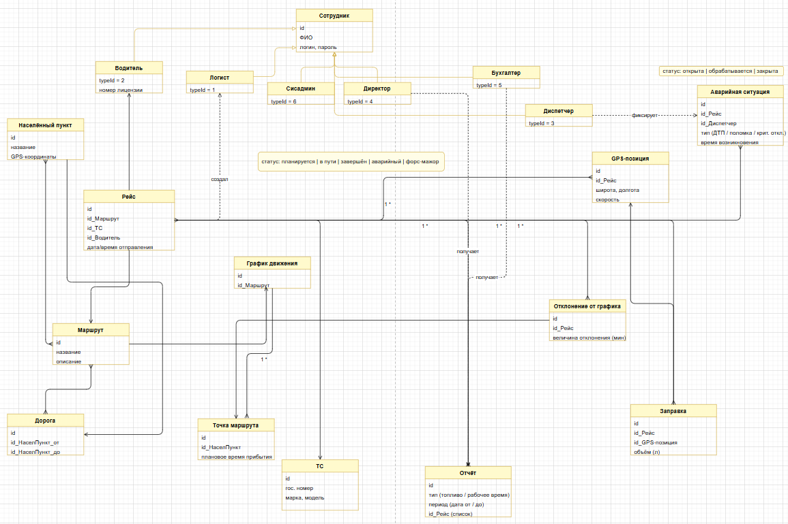

# Документы жизненного цикла ПО. Функциональное проектирование. Бизнес- и системная аналитика.  

**Вариант 12:** Система мониторинга междугородных транспортных перевозок.
Населенные пункты, дорожная сеть, маршрут, планирование движения по маршруту, GPS-
навигация транспортных средств, отслеживание графика движения по маршруту,
обработка аварийных ситуаций, отслеживание заправки, отчеты по расходу топлива и
рабочему времени водителей.

## Фаза исследования. Бизнес-анализ

### Бизнес-архитектура

#### Перечень заинтересованных лиц и пользователей проекта

**Непосредственные пользователи:**
- **диспетчер**,
- **логист**,
- **водитель**,
- **руководитель (Директор)**,
- **системный администратор**.

**Опосредованные участники:**
- **бухгалтер**,

#### Границы проекта

1. **Учет расхода топлива. Бухгалтерия.** Система формирует отчёты по расходу топлива, на основании которых бухгалтер ведёт финансовый учёт.
2. **Расчёт заработной платы. Бухгалтерия.** Система фиксирует рабочее время водителей и формирует соответствующие отчёты, но не производит расчёт заработной платы.
3. **Аналитика.** Система архивирует данные о выполненных операциях, а также 
формирует отчеты, но не производит аналитические расчеты. 
4. **Приём заказов на перевозку.** Система не управляет взаимодействием с клиентами и не оформляет заказы на перевозку грузов.
5. **Техническое обслуживание ТС.** Система фиксирует аварийные события, но не управляет процессом технического обслуживания.
6. **Взаимодействие с экстренными службами.** При аварийной ситуации диспетчер связывается с экстренными службами вне системы.
7. **Автоматическое перепланирование маршрута.** Система уведомляет об отклонениях от графика, но не перестраивает маршрут автоматически.

#### Глоссарий

**Система** —  программная система (ПС), совокупность аппаратных и программных 
компонент.

**Транспортное средство (ТС)** — грузовой автомобиль организации, оснащённый GPS-трекером.

**GPS-трекер** — устройство, установленное на ТС, периодически передающее координаты, скорость и время в систему.

**Населенный пункт** — географический объект (город, посёлок и т.д.) с фиксированными GPS-координатами, являющийся узловой точкой дорожной сети.

**Дорожная сеть** — совокупность дорог между населёнными пунктами.

**Маршрут** — запланированная последовательность из населённых пунктов и дорог между ними.

**Рейс** — конкретное выполнение маршрута: ТС, водитель, дата и время отправления. Имеет один из статусов: планируется, в пути, завершён, авария.

**График движения** — плановое время прибытия ТС в каждую узловую точку маршрута.

**Отклонение от графика** — разность между фактическим и плановым временем прохождения точки маршрута. Отклонение сверх установленного порога формирует уведомление диспетчеру.

**GPS-позиция** — передаваемые данные от GPS-трекера: координаты, скорость, время фиксации.

**Аварийная ситуация** — предусмотренное системой внештатное событие в течение рейса: ДТП, поломка ТС, критическое отклонение от графика. Фиксируется диспетчером; обрабатывается в рамках стандартных процедур. Имеет тип, описание, время возникновения и статус (открыта, обрабатывается, закрыта).

**Заправка** — событие пополнения топлива ТС в ходе рейса. Фиксируется: GPS-позиция, объём в литрах, стоимость.

**Сотрудник** — базовая сущность для диспетчера, логиста, водителя, директора, системного администратора и бухгалтера.

**Диспетчер** — сотрудник. Наблюдает за транспортными средствами на карте, отслеживает отклонения от графика, обрабатывает аварийные ситуации, координирует водителей.

**Логист** — сотрудник. Планирует маршруты и графики, назначает транспортные средства и водителей на рейсы.

**Водитель**- сотрудник. Просматривает маршрут и график, фиксирует заправки, сообщает об аварийных ситуациях.

**Системный администратор** - сотрудник. Занимается настройкой и администрированием системы, управлением учётными записями.

**Бухгалтер** - сотрудник. Получает отчёты по расходу топлива, рабочему времени водителей для учёта.

**Директор** - сотрудник. Получает отчёты по расходу топлива, рабочему времени водителей. Уведомляется диспетчером и принимает решения при форс-мажорах.

**Форс-мажор** — неопределённое состояние рейса, при котором данные системы не отражают реальность. Диспетчер переводит рейс в статус «форс-мажор» и уведомляет директора для принятия управленческого решения.

## Видение проекта

**Название проекта:** Система мониторинга междугородных транспортных перевозок

**Цели проекта:**
- Обеспечить контроль местоположения ТС в режиме реального времени.
- Автоматизировать контроль соблюдения графиков движения с уведомлением диспетчера.
- Сократить время реакции на аварийные ситуации за счёт оперативного уведомления диспетчера.
- Вести учёт заправок и рассчитывать фактический расход топлива.
- Предоставить аналитические отчёты для управления затратами и ресурсами.

**Приоритет проекта:** средний. Оптимизирует работы, дает возможность их мониторинга в режиме реального времени.

**Результаты проекта:**
- Web/desktop-приложение диспетчера и логиста с картой и списками рейсов.
- Desktop-приложение с модулем отчётов.
- Мобильное приложение водителя (Android) — просмотр маршрута, фиксация заправок и аварий.
- Серверный модуль.

**Допущения и ограничения:**
- Все ТС оснащены GPS-трекерами.
- Все населенные пункты существуют и корректно отображены на картах.

**Ключевые участники:**
- диспетчер,
- логист,
- водитель,
- директор,
- системный администратор.

**Заинтересованные стороны:**
- бухгалтер.

**Ресурсы проекта:**
- Команда разработки (backend, frontend, мобильная разработка).
- GPS-трекеры на ТС.
- Сервер для приёма данных и хранения истории.

**Риски:**
- Потеря GPS-сигнала в зонах слабого покрытия мобильной сети.
- Ложные уведомления при кратковременных сбоях связи.
- Неточность GPS в городской застройке.

**Критерии приёмки:**
- Задержка отображения позиции ТС ≤ 120 секунд;
- Уведомление об отклонении от графика ≤ 60 минут после события;
- Корректная генерация отчётов за произвольный период.

**Обоснование полезности проекта:**
Система снижает операционные затраты за счет контроля расхода топлива, повышает безопасность перевозок через оперативное реагирование на аварии, обеспечивает объективный учет рабочего времени водителей.

## Моделирование бизнес-процессов

### Неформальное описание бизнес-процессов. Выделение бизнес-сущностей.

Организация осуществляет междугородные транспортные перевозки на **транспортных средствах (ТС)**, оснащённых **GPS-трекерами**.

Логист формирует **маршруты** — последовательности **населённых пунктов**, соединённых **дорогами**. Для каждого маршрута логист составляет **график движения**.
Для выполнения конкретной перевозки логист формирует **рейс**: назначает **маршрут**, **ТС**, водителя, устанавливает дату и время отправления.
Водитель через мобильное приложение получает маршрутный лист с **графиком**.

В ходе **рейса** GPS-трекер ТС периодически передаёт **GPS-позиции** на сервер системы.

Диспетчер в режиме реального времени наблюдает за движением всех **ТС** на карте. Система автоматически сравнивает фактическое прохождение **точек маршрута** с плановым **графиком движения**. При **отклонении от графика** сверх допустимого порога диспетчер получает уведомление, связывается с водителем и принимает решение.

При возникновении **аварийной ситуации** водитель сообщает об этом диспетчеру через приложение. Диспетчер фиксирует событие в системе, переводит **рейс** в статус «аварийный». Организация помощи происходит вне системы.

При возникновении **форс-мажора** (длительной потере GPS-сигнала или устойчивом расхождении данных системы с реальностью) диспетчер фиксирует состояние и уведомляет директора. Директор принимает решение вне системы.

Водитель самостоятельно регистрирует **заправку**: указывает место, объём топлива и стоимость. Система автоматически сравнивает данные с **нормативом расхода**.

По завершении **рейса** директор и бухгалтер получают **отчёты** по расходу топлива и по рабочему времени водителей. Данные **отчётов** используются для расчёта оплаты труда и контроля затрат вне системы.

### Формальное описание бизнес-процессов.

BPMN-диаграмма:

UML-диаграмма:

## Фаза развития. Системная аналитика

### Представление предметной области. Модель классов анализа

Модель классов анализа учитывает преобразование модели предметной области
в связи с включением в бизнес-процессы программной системы. Модель
предметной области напрямую переносится в модель классов анализа.
Добавление сущностей и свойств производится с учётом специфических
IT-элементов:

1. Для внутренней и автономной идентификации рейсу присваивается код в
формате <год>.<месяц>.<порядковый номер в месяце>.
2. Изменение статуса рейса (планируется,в пути, завершён, аварийный,
форс-мажор) сопровождается push-уведомлением в мобильное приложение
водителя и обновлением интерфейса диспетчера в реальном времени.
3. GPS-позиции передаются от трекера на сервер периодически с интервалом,
настраиваемым системным администратором. При отсутствии сигнала свыше
порогового времени система автоматически формирует событие потери связи
и уведомляет диспетчера.
4. Для фиксации форс-мажоров и разбора спорных ситуаций вводится журнал
событий, в котором фиксируются все значимые действия: входы/выходы
сотрудников, смены статусов рейсов, уведомления, операции с аварийными
ситуациями. События делятся на обычные и важные. Важные события связаны
с аварийными ситуациями и форс-мажорами.

### Разработка требований

Иерархическая система требований (перечень не полный, в том числе для
приведённого уровня описания бизнес-процессов и модели предметной области).

#### Бизнес-правила

**Бизнес.норматив_расхода_топлива** — для каждого ТС устанавливается
норматив расхода топлива в литрах на 100 км. Система автоматически
сравнивает фактический расход по зафиксированным заправкам с нормативом.

**Бизнес.порог_отклонения** — для каждого маршрута устанавливается
допустимый порог отклонения от графика в минутах. Превышение порога
формирует уведомление диспетчеру.

**Бизнес.статус_рейса** — рейс последовательно проходит статусы:
планируется → в пути → завершён. Переход в статус «аварийный» или
«форс-мажор» возможен из статуса «в пути» по инициативе диспетчера.

**Бизнес.рабочее_время_водителя** — рабочее время водителя в рейсе
фиксируется как интервал от фактического времени отправления до
фактического времени завершения рейса.

**Бизнес.стоимость_заправки** — стоимость заправки фиксируется водителем
в момент события и не может быть изменена после закрытия рейса без
подтверждения директора.

#### Функциональные требования

**Рейс.идентификация.код** — для внутренней и автономной идентификации
рейсу присваивается код в формате
`<год>.<месяц>.<порядковый номер в месяце>`.

**Рейс.статус** — система фиксирует текущий статус рейса и историю его
изменений с указанием времени и инициатора изменения.

**Рейс.отклонение.уведомление** — при превышении порога отклонения от
графика система автоматически формирует уведомление диспетчеру с
указанием рейса, точки маршрута и величины отклонения.

**Рейс.форс-мажор** — диспетчер переводит рейс в статус «форс-мажор»
с фиксацией причины. Система уведомляет директора. Важное событие в
журнале.

**Водитель.маршрутный_лист** — после формирования рейса логистом система
автоматически отправляет маршрутный лист с графиком в мобильное приложение
водителя.

**Водитель.заправка.регистрация** — водитель регистрирует заправку через
мобильное приложение: указывает место (GPS-позиция определяется
автоматически), объём в литрах и стоимость. Система автоматически
сравнивает данные с нормативом расхода ТС.

**Водитель.авария.сообщение** — водитель сообщает об аварийной ситуации
через мобильное приложение с указанием типа события. Система уведомляет
диспетчера.

**Диспетчер.карта** — диспетчер наблюдает за актуальным положением всех ТС
на карте в режиме реального времени с задержкой не более значения,
установленного в критериях приёмки.

**Диспетчер.авария.фиксация** — диспетчер фиксирует аварийную ситуацию
в системе: указывает тип, описание. Рейс переводится в статус «аварийный».
Важное событие в журнале.

**Диспетчер.авария.закрытие** — диспетчер закрывает аварийную ситуацию
после её устранения с фиксацией времени закрытия.

**Логист.маршрут.редактирование** — логист создаёт и редактирует маршруты:
добавляет/удаляет населённые пункты и дороги, задаёт порядок следования.

**Логист.рейс.формирование** — логист формирует рейс: выбирает маршрут,
назначает ТС и водителя, устанавливает дату и время отправления.

**Логист.график.составление** — для каждого рейса логист составляет график
движения: задаёт плановое время прибытия в каждую узловую точку маршрута.

**Форс-мажор.потеря_сигнала** — при отсутствии GPS-сигнала от ТС свыше
порогового времени система формирует событие потери связи и уведомляет
диспетчера. Диспетчер принимает решение о переводе рейса в статус
«форс-мажор».

**Форс-мажор.расхождение_данных** — при устойчивом расхождении данных
системы с реальностью диспетчер переводит рейс в статус «форс-мажор»
и уведомляет директора для принятия управленческого решения вне системы.

#### Требования GUI и приложений

**GUI.диспетчер.приложение.web/desktop** — основное окно содержит карту
с актуальным положением ТС и список активных рейсов. Список рейсов
сопровождается набором кнопок, активизирующих вспомогательные окна.

**GUI.логист.приложение.web/desktop** — основное окно содержит списки
маршрутов и рейсов. Каждый список сопровождается набором кнопок для
создания и редактирования.

**GUI.водитель.приложение.Android** — мобильное приложение водителя
отображает маршрут и текущий график, позволяет зафиксировать заправку
и сообщить об аварийной ситуации.

**GUI.директор.приложение.desktop** — основное окно содержит список
рейсов и модуль отчётов.

**GUI.основное_окно.дизайн** — дизайн «предметная область с набором
инструментов». Основное окно содержит списки сущностей (рейсы, маршруты,
ТС), предназначенные сотруднику. Каждый список сопровождается набором
кнопок, активизирующих вспомогательные окна.

**GUI.вспомогательные_окна.дизайн** — дизайн «сценарий, ведомый GUI».
Каждое окно отвечает за отдельный шаг сценария и содержит необходимые
элементы управления для ввода или выбора параметров.

#### Атрибуты качества

**Качество.Безопасность.Авторизация** — логины и пароли всех сотрудников,
привязанные к ним роли.

**Качество.Безопасность.Роли.Директор** — корректировать данные о
сотрудниках и их ролях может только директор и системный администратор.

**Качество.Безопасность.Роли.Системный_администратор** — имеет права
суперпользователя при подтверждении авторизации директором.

**Качество.Безопасность.Тайм-аут_авторизации** — при отсутствии активности
сотрудника в приложении оно автоматически блокируется по истечении
интервала блокировки. Деблокирование производится повторной авторизацией.

**Качество.Производительность.GPS** — задержка отображения позиции ТС на
карте диспетчера не превышает значения, установленного в критериях приёмки.

**Качество.Доступность.Мобильное_приложение** — мобильное приложение
водителя должно сохранять данные о заправках и аварийных ситуациях локально
при отсутствии связи с сервером и синхронизировать их при восстановлении
соединения.

#### Отчёты, документы, сведения

**Отчёт.топливо** — за указанный период по рейсу / водителю / ТС:
суммарный объём заправок, фактический расход (л/100 км), отклонение от
норматива, суммарная стоимость заправок.

**Отчёт.рабочее_время** — за указанный период по водителю: суммарное
рабочее время в рейсах, количество рейсов, пробег.

**Отчёт.рейс** — по конкретному рейсу: маршрут, ТС, водитель, плановое и
фактическое время прохождения каждой точки, отклонения от графика, заправки,
аварийные ситуации.

**Сведения.активные_рейсы** — список рейсов со статусом «в пути»:
ТС, водитель, маршрут, последняя GPS-позиция, отклонение от графика.

**Сведения.аварии** — список открытых и обрабатываемых аварийных ситуаций
с указанием рейса, типа, времени возникновения.

**Документ.маршрутный_лист** — маршрут рейса с графиком движения:
последовательность населённых пунктов, плановое время прибытия в каждую
точку, данные о ТС и водителе.

### Прецеденты и сценарии

### Графический интерфейс

#### Диаграммы окон (оконные диаграммы)

**Водитель. Мобильное приложение (Android).** Приложение является
справочно-оперативным: отображает маршрутный лист и график, принимает
от водителя данные о заправках и аварийных ситуациях. Все данные
синхронизируются с сервером. При отсутствии связи сохраняются локально.

| | Номер | Форма | | Содержимое заголовка | Переход | Примечание |
|---|---|---|---|---|---|---|
| Водитель | 1 | Авторизация | Логин | | | |
| | | | Пароль | | | |
| | | | Войти | кнопка | Войти | ->2 |
| | 2 | Главная | рейсы | список | маршрут / дата | ->3 |
| | | | тек.рейс | кнопка | текущий рейс | ->3 |
| | 3 | Рейс | маршрут | | название | |
| | | | точки маршрута | список | НП / план. время | ->4 |
| | | | Заправка | кнопка | | ->5 |
| | | | Авария | кнопка | | ->6 |
| | | | Завершить рейс | кнопка | | ->7 |
| | 4 | Точка маршрута | населённый пункт | | | |
| | | | план. время прибытия | | | |
| | | | факт. время прибытия | | | |
| | | | отклонение (мин) | | | |
| | 5 | Заправка | GPS-позиция | | определяется авто | |
| | | | объём (л) | поле ввода | | |
| | | | стоимость (руб) | поле ввода | | |
| | | | Сохранить | кнопка | | ->3 |
| | 6 | Авария | тип аварии | список | ДТП / поломка / откл. | |
| | | | описание | поле ввода | | |
| | | | Отправить | кнопка | | ->3 |
| | 7 | Завершение рейса | подтверждение | | | |
| | | | Подтвердить | кнопка | | ->2 |
| | 8 | Меню настроек | адрес сервера | | | |
| | | | порт сервера | | | |

---

**Диспетчер / Логист. Web/Desktop-приложение.** Основная цель —
минимизация действий при мониторинге рейсов и управлении маршрутами.
Главное окно содержит карту и списки. Все окна имеют кнопку закрытия,
по которой прекращается выполнение текущей операции и производится
возврат в предыдущее окно с сохранением результата.

| | Номер | Форма | | Содержимое | Переход | Примечание |
|---|---|---|---|---|---|---|
| Диспетчер | 1 | Авторизация | Логин | | | |
| | | | Пароль | | | |
| | | | Войти | кнопка | | ->2 |
| | 2 | Главная | карта ТС | карта | позиции ТС | |
| | | | активные рейсы | список | маршрут / статус / откл. | ->3 |
| | | | уведомления | список | тип / рейс / время | ->3 |
| | | | Новая авария | кнопка | | ->6 |
| | 3 | Рейс подробно | маршрут | | | |
| | | | ТС, водитель | | | |
| | | | статус рейса | | | |
| | | | точки маршрута | список | НП / план / факт / откл. | |
| | | | GPS-трек | карта | | |
| | | | заправки | список | место / объём / стоим. | |
| | | | аварии | список | тип / статус | ->6 |
| | | | Закрыть рейс | кнопка | | ->7 |
| | | | Форс-мажор | кнопка | | ->8 |
| | 4 | Архив рейсов | рейс | список | маршрут / дата / статус | ->3 |
| | | | фильтр период | | | |
| | 5 | Архив аварий | авария | список | тип / рейс / статус | ->6 |
| | 6 | Авария | тип | список | ДТП / поломка / откл. | |
| | | | описание | поле ввода | | |
| | | | статус | | открыта / обраб. / закрыта | |
| | | | Сохранить | кнопка | | ->3 |
| | 7 | Закрытие рейса | подтверждение | | | |
| | | | Подтвердить | кнопка | | ->2 |
| | 8 | Форс-мажор | причина | поле ввода | | |
| | | | Уведомить директора | кнопка | | ->3 |
| Логист | 9 | Маршруты | маршрут | список | название | ->10 |
| | | | Новый маршрут | кнопка | | ->10 |
| | 10 | Маршрут | название | поле ввода | | |
| | | | точки маршрута | список | НП / порядок | |
| | | | Добавить НП | кнопка | | ->11 |
| | | | Сохранить | кнопка | | ->9 |
| | 11 | Выбор НП | населённый пункт | список | название / координаты | |
| | | | Выбрать | кнопка | | ->10 |
| | 12 | Рейсы | рейс | список | маршрут / ТС / дата / статус | ->13 |
| | | | Новый рейс | кнопка | | ->13 |
| | 13 | Рейс (редакт.) | маршрут | список выбора | | |
| | | | ТС | список выбора | | |
| | | | водитель | список выбора | | |
| | | | дата отправления | дата/время | | |
| | | | график (точки) | список | НП / план. время | ->14 |
| | | | Сохранить | кнопка | | ->12 |
| | 14 | Точка графика | населённый пункт | | | |
| | | | плановое время | поле ввода | | |
| | | | Сохранить | кнопка | | ->13 |

---

**Директор. Desktop-приложение.** Основное окно содержит список рейсов
и модуль отчётов. Директор получает уведомления о форс-мажорах и
принимает управленческие решения.

| | Номер | Форма | | Содержимое | Переход | Примечание |
|---|---|---|---|---|---|---|
| Директор | 1 | Авторизация | Логин | | | |
| | | | Пароль | | | |
| | | | Войти | кнопка | | ->2 |
| | 2 | Главная | уведомления | список | форс-мажоры / аварии | ->3 |
| | | | рейсы | список | маршрут / статус | ->3 |
| | | | Отчёты | кнопка | | ->4 |
| | | | Сотрудники | кнопка | | ->6 |
| | 3 | Рейс подробно | данные рейса | | только просмотр | |
| | | | Принять решение | кнопка | | ->5 |
| | 4 | Отчёты | тип отчёта | список | топливо / раб. время | |
| | | | период от / до | дата | | |
| | | | водитель / ТС | список выбора | | |
| | | | Сформировать | кнопка | | |
| | | | Экспорт | кнопка | doc/xlsx | |
| | 5 | Решение по форс-мажору | описание ситуации | | | |
| | | | решение | поле ввода | | |
| | | | Подтвердить | кнопка | | ->2 |
| | 6 | Сотрудники | сотрудник | список | ФИО / роль | ->7 |
| | | | Добавить | кнопка | | ->7 |
| | 7 | Сотрудник | ФИО | поле ввода | | |
| | | | роль | список выбора | | |
| | | | логин | поле ввода | | |
| | | | Сохранить | кнопка | | ->6 |
